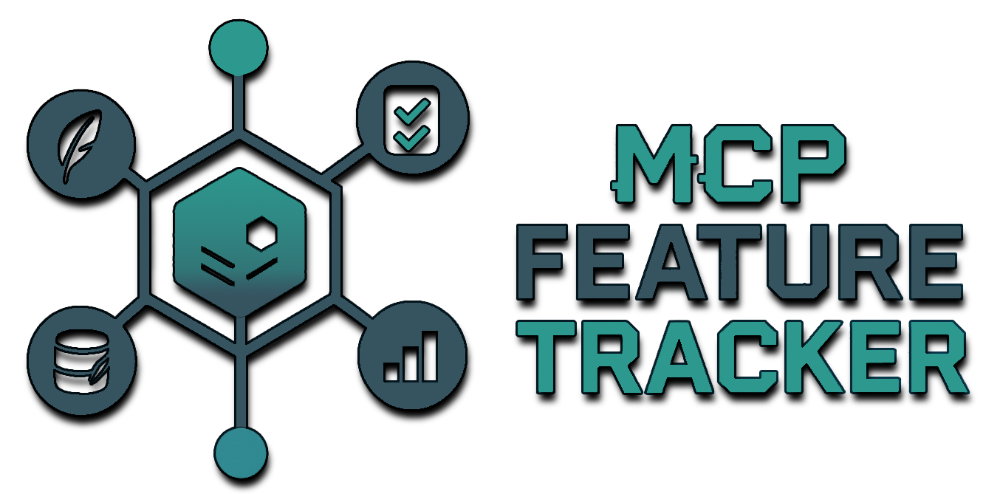



# MCP Feature Tracker

A lightweight Node.js server implementing the MCP (Multi-Capability Partnership) protocol for basic project tracking. This server helps you (or your AI coding assistant!) keep track of project tasks, notes, decisions, and goals right from your workspace using simple SQLite databases.

## Features

Here's what this server can do for you:

*   **Task Management:** Create, update, delete, and track tasks with statuses (BACKLOG, IN_PROGRESS, DONE) and dependencies.
*   **Notes:** Add and manage project-related notes, optionally linking them to tasks and adding tags.
*   **Decisions:** Log design decisions with rationale and alternatives, linking them to tasks.
*   **Goals:** Define and track high-level project goals.
*   **Search:** Search across tasks, notes, and decisions.
*   **MCP Compliant:** Exposes functionality through a standardized MCP API.
*   **SQLite Backend:** Simple, file-based data storage.

## Prerequisites

*   **Node.js:** Version 16.x or later recommended.
*   **npm** or **yarn:** Package manager for Node.js.

## Installation

1.  **Clone the repository:**
    ```bash
    git clone https://github.com/ChiefBoyardee/mcp-feature-tracker.git
    cd mcp-feature-tracker
    ```

2.  **Install dependencies:**
    ```bash
    npm install
    # or
    yarn install
    ```

## Configuration

You can tweak how the server runs using these settings (usually set as environment variables before starting the server):

*   `MCP_PORT`: The port the server will listen on. Defaults to `31337`.
*   `MCP_DATA_DIR`: The directory where SQLite database files will be stored. Defaults to `./.mcp_data` relative to the server's running directory. The server will create this directory if it doesn't exist.

*(Note: The default port `31337` is used in the client configuration examples below unless specified otherwise.)*

Example (`.env` file or export commands):

```bash
MCP_PORT=31338
MCP_DATA_DIR=/path/to/your/persistent/data
```

## Running the Server

Getting the server running is straightforward:

You can run the server directly using Node.js:

```bash
node server.js
```

Or using the npm script defined in `package.json`:

```bash
npm start
```

The server will log its startup status, including the port it's listening on and the data directory it's using.

### Running as a Background Service (Optional)

Want the server to keep running even after you close your terminal? You can use tools like `pm2` or your operating system's service manager.

**Using `pm2` (A popular Node.js process manager):**

1.  Install `pm2` globally (if you haven't already): `npm install pm2 -g`
2.  Start the server with `pm2`:
    ```bash
    # Basic start
    pm2 start server.js --name mcp-feature-tracker

    # Start with environment variables
    MCP_PORT=31338 MCP_DATA_DIR=/your/chosen/data/path pm2 start server.js --name mcp-feature-tracker
    ```
3.  Manage the service: `pm2 list`, `pm2 stop mcp-feature-tracker`, `pm2 restart mcp-feature-tracker`, `pm2 logs mcp-feature-tracker`.

**Platform-Specific Notes:**

*   **Windows:** You can use `pm2` on Windows, or create a scheduled task. Ensure the `MCP_DATA_DIR` path is valid Windows syntax (e.g., `C:\Users\YourUser\mcp_server_data`).
*   **macOS/Linux:** `pm2` or creating a `systemd` service file are common approaches. Ensure the user running the server has write permissions to the `MCP_DATA_DIR`.

## Usage: Connecting MCP Clients

Any MCP-compatible client (like AI coding assistants) can connect to this server to manage project information.

**Important Initialization Step:** Before your client can talk to the server about a *specific* project, there's one important step: initialization. The client needs to tell the server the **absolute path** to your project's workspace folder. This allows the server to use the correct database for that project.

This is done by making an initial call to the `mcp_feature-tracker_initializeProjectContext` endpoint:

```json
// Example MCP Tool Call
{
  "tool_name": "mcp_feature-tracker_initializeProjectContext",
  "parameters": {
    "workspaceFolderPath": "/absolute/path/to/your/project/workspace"
    // On Windows, use double backslashes or forward slashes:
    // "workspaceFolderPath": "C:\Users\YourUser\Documents\MyProject"
    // "workspaceFolderPath": "C:/Users/YourUser/Documents/MyProject"
  }
}
```

Once initialized, the client can use other endpoints like `addTask`, `getTasks`, `addNote`, `getDecisions`, etc.

### Example Client Configurations

Below are examples of how you might configure different MCP clients to use this server. Replace placeholders with your actual server details and project path. **Refer to the specific client's documentation for the most accurate configuration method.**

**1. Cursor:**

Configure Cursor by editing its `mcp.json` file (usually found via `Settings ⚙️ > MCP > + Add new global MCP server`)

```json
"cursor.mcpProviders": [
  {
    "name": "Local Feature Tracker",
    "apiBaseUrl": "http://localhost:31337", // Or your configured MCP_PORT
    "toolPrefix": "mcp_feature-tracker" // Conventionally matches the server's prefix
  }
]
```
*Remember to call `initializeProjectContext` with the workspace path as the first action in a new Cursor project.*

**2. Windsurf:**

Configure Windsurf via its UI, likely through the Settings menu, the Cascade panel (hammer icon 🔨 -> Configure), or the Chat panel (+ Configure MCP):

*   Find the section for adding/managing MCP servers.
*   Provide a name (e.g., "Local Feature Tracker").
*   Enter the server URL: `http://localhost:31337` (or your configured `MCP_PORT`).
*   Enter the Tool Prefix: `mcp_feature-tracker`.

*Initialization Call Required:* `mcp_feature-tracker_initializeProjectContext` with `workspaceFolderPath`.

**3. Claude Code:**

Configure Claude Code via its Settings menu:

*   Look for a section related to MCP or Tool Servers.
*   Add a new server configuration.
*   Provide a name (e.g., "MyTracker").
*   Enter the Base URL: `http://localhost:31337/`
*   Optionally, set a tool filter if available: `mcp_feature-tracker_*`

*Initialization Call Required:* `mcp_feature-tracker_initializeProjectContext` with `workspaceFolderPath`.

**4. Cline (CLI Tool):**

Configure Cline either by setting environment variables *before* running commands, or by editing its configuration file:

```bash
# Set environment variables for the current session
export MCP_SERVER_URL=http://localhost:31337
export MCP_TOOL_PREFIX=mcp_feature-tracker

# First command for a project (initialization)
cline mcp call mcp_feature-tracker_initializeProjectContext '{"workspaceFolderPath": "/path/to/project"}'

# Subsequent commands
cline mcp call mcp_feature-tracker_addTask '{"title": "New Task", "description": "..."}'
```

**5. Roo:**

Configure Roo using its settings interface:

*   **Server Name:** Local Feature Tracker
*   **Base URL:** `http://localhost:31337`
*   **Tool Prefix:** `mcp_feature-tracker`
*   *(Initialization Call Required via Roo's interface/first command)*

**Important:** While these examples provide common patterns, always refer to the specific MCP client's documentation for the most up-to-date and accurate configuration method. The key details needed are the server's base URL (`http://localhost:PORT`) and the tool prefix (`mcp_feature-tracker`).

## Contributing

Contributions are welcome! Please feel free to submit pull requests or open issues on the [GitHub repository](https://github.com/ChiefBoyardee/mcp-feature-tracker).

**Repository:** [https://github.com/ChiefBoyardee/mcp-feature-tracker](https://github.com/ChiefBoyardee/mcp-feature-tracker)

**Author:** ChiefBoyardee jayjewellroth@gmail.com

## License

This project is licensed under the MIT License - see the [LICENSE](LICENSE) file for details.
